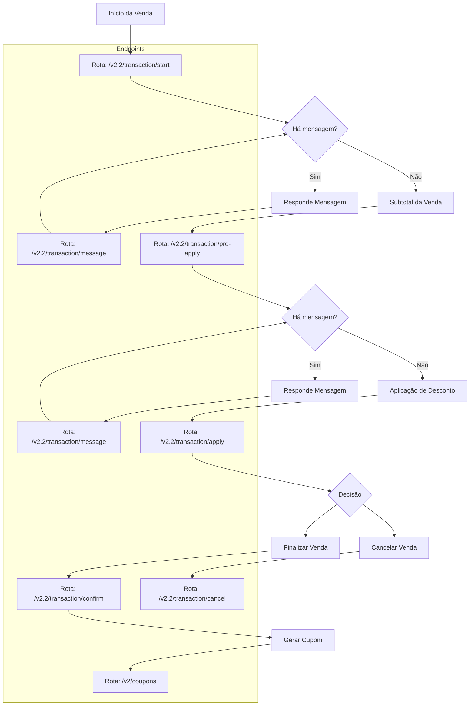
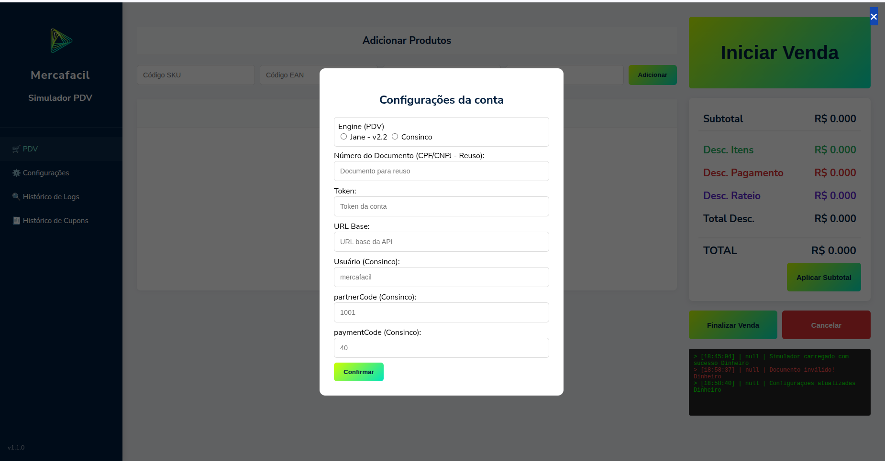
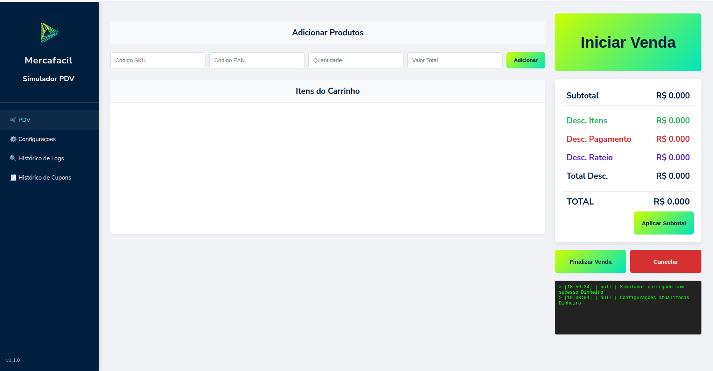
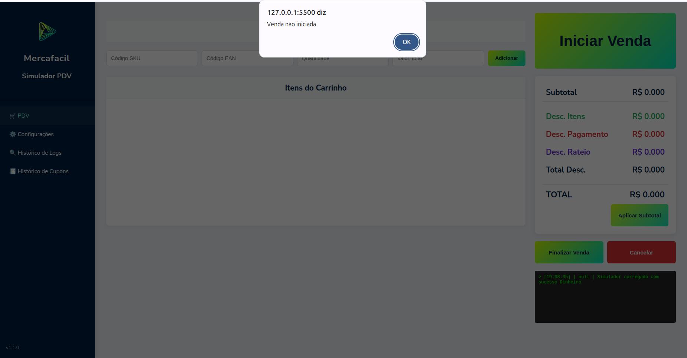
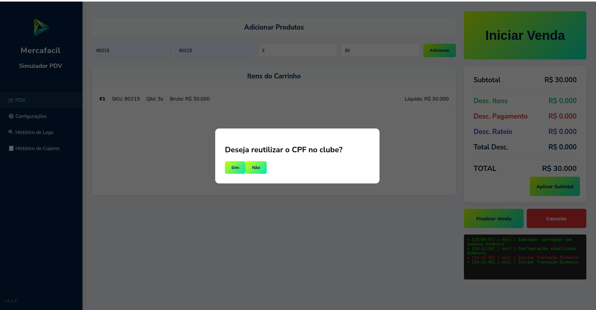

# Simulador de PDV

Este projeto é um simulador de Ponto de Venda (PDV) desenvolvido para validar e testar fluxos de integração com APIs de transações e CRM. Ele permite simular o ciclo de vida de uma venda, desde o início da transação, resposta de mensagens dinâmicas, aplicação de descontos, finalização ou cancelamento da transação e geração do cupom.

## 📱 Estrutura do Simulador

O projeto é dividido em quatro módulos principais, acessíveis pelo menu lateral:

* **🖥️ PDV**: A interface principal de vendas. É aqui que o usuário insere o documento de identificação e inicia o fluxo de transação com a API.
* **⚙️ Configurações**: Local para gerenciar as variáveis de ambiente, como a URL Base da API e tokens de autenticação, armazenados no estado global da aplicação.
* **🔍 Histórico de Logs**: Menu técnico que registra todas as requisições enviadas e respostas recebidas. Permite a inspeção de payloads JSON via modal detalhado.
* **🎫 Histórico de Cupons**: Exibição dos cupons gerados após a finalização bem-sucedida das transações.

## 🚀 Funcionalidades

- **Simulação de Vendas**: Simula uma venda real com comunicação de APis externos.
- **Mensagens Dinâmicas**: Interface preparada para processar e responder payloads complexos da API.
- **Sistema de Logs**: Histórico detalhado de requisições e respostas com visualização em modal.
- **Visualização de Cupom**: Simula a criação de um Cupom Fiscal pós finalização da venda.
- **Arquitetura Centralizada**: Uso de uma função principal para gerenciar chamadas HTTP via Fetch API.

## 🏗️ Arquitetura do Sistema

Para manter o código organizado, o simulador é dividido em responsabilidades claras:

- **Interface e Visual (UI)**: Arquivos que cuidam do que o usuário vê (HTML/CSS) e das funções que mexem na tela, como abrir modais e exibir alertas.
   - ui.js
- **Lógica de Comunicação (Engines) e Gerenciamento**: Arquivos que cuidam da centralização de comunicação com as APIs. Cada API tem uma engine, com um sistema que controla qual engine será utilizada para a venda atual. Além disso, criado uma Função Mestre de API (executarChamadaAPI), centralizando o tratamento de erros (try/catch), o gerenciamento de estados e a geração de logs em um único ponto, tornando o código mais modular e fácil de manter.
   - janev22.js -> Engine da API v2.2 da Mercafacil
   - consinco.js -> Engine da API do Acrux PDV da Consinco (TOTVS)
   - engineManager.js -> Sistema de controle de engines
- **Gerenciamento de Dados (State)**: Arquivo central que guarda as informações importantes da transação atual.
   - state.js
- **Funções úteis**: Funções de apoio para o funcionamento das engines.
   - utils.js
- **Gerenciador do Sistema**: Arquivo principal que gerencia toda a aplicação, liga toda arquitetura do sistema

## 🛠️ Tecnologias Utilizadas

* [JavaScript Vanilla](https://developer.mozilla.org/pt-BR/docs/Web/JavaScript) (ES6+) Lógica principal e manipulação do DOM.
* [HTML5](https://developer.mozilla.org/pt-BR/docs/Web/HTML) & [CSS3](https://developer.mozilla.org/pt-BR/docs/Web/CSS)
* [Fetch API](https://developer.mozilla.org/pt-BR/docs/Web/API/Fetch_API) Consumo de serviços REST.

## ⚙️ Repositório

1. Clone o repositório:
   ```bash
   git clone [https://github.com/ByNocturne/SimuladorPDV.git](https://github.com/ByNocturne/SimuladorPDV.git)

## Fluxo de comunicação das APIs (Separado por Engines)



## Guia de operação

1. Defina as configurações para realização dos testes
- Na aba lateral com um menu chamado "Configurações"

   - Engine (PDV) **Obrigatório** -> Selecione qual engine será utilizada para simular a venda
   - Número do Documento (CPF/CNPJ - Reuso) ->  Caso queira simular uma captura de identificação antes do início da transação, adicione aqui o seu documento. Caso contrário, a venda iniciará sem o documento, cabendo a API solicitá-lo, pode-se utilizar para todas as Engines.
   - Token **Obrigatório** -> Token para autenticação das APIs, pode-se utilizar para todas as Engines.
   - URL Base **Obrigatório** -> URL para comunicação das APIs, pode-se utilizar para todas as Engines,
   - Usuário (Consinco) -> Por default "mercafacil", é o usuário da autenticação para a comunicação com as APis da Consinco, pode-se utilizar apenas para a Engine Consinco.
   - partnerCode (Consinco) **Obrigatório**-> código de parceiro, que simula o código do sistema para a API, por exemplo, se o desconto foi dado pelo Simulador ou por outra fonte, pode-se utilizar apenas para a Engine Consinco.
   - paymentCode (Consinco) -> Caso queira simular uma venda com desconto contendo uma finalizadora para Cashback, esté o do id da Finalizadora de Pagamento, pode-se utilizar apenas para a Engine Consinco.

2. Após as configurações serem salvas, o usuário pode iniciar a Venda, caso clique em outro botão (subtoral, finalização ou cancelamento da venda) irá aparecer um alerta informando que a venda não iniciou, obrigando o usuário iniciar a venda.



3. Ao iniciar a venda, poderá ou não conter uma mensagem que poderá ou não solicitar a digitação do CPF ou do telefone, dependerá do retorno da API. Após reponder todas as mensagens, prosseguir com a venda.


4. Adicione os produtos no Carrinho, contendo todas as informações (Sku, Ean, Quantidade total de itens ou o valor Kg (3 casas decimais) do produto, Valor total Bruto do item (Ja multiplicado com a quantidade)). Clique no botão Adicionar para que o produto seja adicionado no carrinho.


Atualizar daqui pra frente, preciso finalizar minha refatoração.

